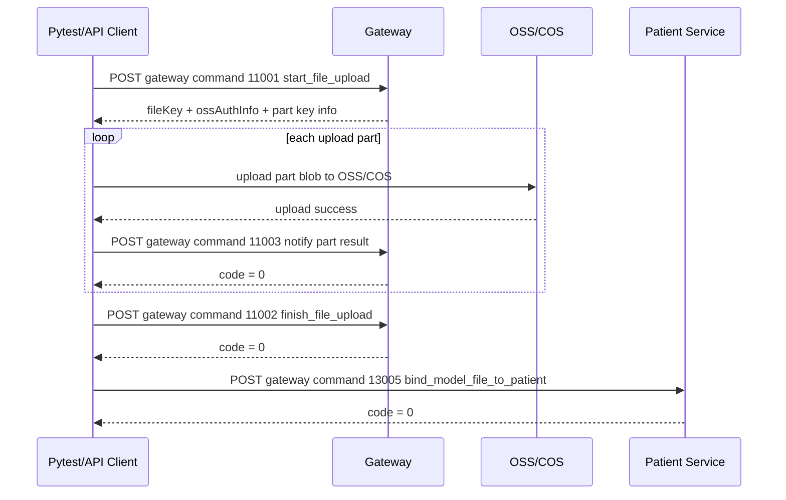

# CT 附件上传与患者绑定接口规格

本文档按 `$api-pytest-builder` 的输入习惯整理，可用于后续生成：

`api/common/client.py -> api/<domain>/<domain>_api.py -> tests/api/single_api/test_<domain>_api.py`

## 范围

本文档覆盖 CT/模型附件从上传、完成、绑定患者、查询、更新绑定信息到解绑的接口。

主结论：

- 最终绑定到患者的是完整 CT 的主 `fileKey`。
- `partID` 只代表上传传输分片或合并批次，不代表最终附件。
- 只有 `finishFileUpload` 成功后，才认为完整 CT 上传完成。
- 缩略图和 `ct_*.png` 等派生附件使用主 CT 的 `fileKey` 作为 `parentKey`，不再次绑定患者。

## 自动化实现约束

- 网关接口统一使用：

```python
self.client.send_request("POST", command="11001", json=payload)
```

- 普通路径接口统一使用：

```python
self.client.send_request("POST", path="/upload_part", json=payload)
```

- 业务 API 方法不注入 Cookie，认证 Cookie 由 `HTTPClient.send_request()` 通过 `config/environment.yaml` 的 `sessionCookie` 注入。
- Python 方法参数使用 snake_case，payload wire key 保持后端字段原样，例如 `patientID`、`fileKey`、`dateOfBirth`。
- 必填字段定义为必填 Python 参数，选填字段默认 `None`。
- 选填字段只有 `value is not None` 时才写入 payload，以保留显式空字符串。
- API 方法返回原始 `requests.Response`，断言写在 pytest 中。

## 建议模块

### `api/file/file_api.py`

建议类名：`FileAPI`

建议方法：

- `start_file_upload(...)`
- `notify_file_chunk_upload_result(...)`
- `finish_file_upload(...)`
- `search_file_description(...)`
- `upload_file_part_backend(...)`
- `upload_single_file_backend(...)`

### `api/patient/patient_api.py`

建议类名：`PatientAPI`

建议方法：

- `bind_model_file_to_patient(...)`
- `unbind_model_file_to_patient(...)`
- `search_patient_detail_v2(...)`
- `change_bind_file(...)`

### 建议测试文件

- `tests/api/single_api/test_file_api.py`
- `tests/api/single_api/test_patient_file_api.py`

测试应添加：

- `@pytest.mark.api`
- `@allure.feature("CT 附件上传")`
- `@allure.story(...)`

## 枚举

### Gateway Command

| 业务动作 | Command |
| --- | --- |
| 开启分片上传 | `11001` |
| 完成完整文件上传 | `11002` |
| 通知单个分片上传结果 | `11003` |
| 查询文件描述 | `11004` |
| 绑定模型文件到患者 | `13005` |
| 解绑模型文件 | `13006` |
| 查询患者详情 V2 | `13007` |
| 修改绑定文件信息 | `13008` |

### EntryPoint

| 值 | 含义 | 使用场景 |
| --- | --- | --- |
| `1` | 模型/CT 主文件 | 完整 CT 或 STL/DRC/PLY 主附件 |
| `2` | 模型缩略图/派生附件 | `thumbnail.png`、`ct_*.png` |

## 完整 CT 上传主流程

### 调用顺序

1. `start_file_upload`，Command `11001`，创建完整 CT 上传会话，得到主 `fileKey`。
2. 客户端将 CT 原文件读取、加头、读取 CT header、压缩、合并窗口、加密。
3. 每个合并窗口生成一个上传 part，上传到 OSS/COS。
4. 每个 part 上传云端成功后调用 `notify_file_chunk_upload_result`，Command `11003`。
5. 所有 part 都通知成功后调用 `finish_file_upload`，Command `11002`，提交完整 CT 元数据。
6. `finish_file_upload` 成功后调用 `bind_model_file_to_patient`，Command `13005`，用主 `fileKey` 绑定患者。
7. 绑定成功后可调用 `search_patient_detail_v2` 或 `search_file_description` 验证。
8. 缩略图或预览图作为派生附件上传，`parentKey` 使用主 CT 的 `fileKey`，不再次绑定患者。

### Mermaid 流程



## 接口规格

### 1. 开启分片上传

建议方法名：`FileAPI.start_file_upload`

请求：

- Method: `POST`
- Transport: gateway command
- Command: `11001`

必填字段：

| Python 参数 | Wire key | 类型 | 说明 |
| --- | --- | --- | --- |
| `file_name` | `fileName` | `str` | 主 CT 场景使用 `handled_origin_data` 或测试文件名 |
| `entry_point` | `entryPoint` | `int` | 主 CT 使用 `1` |
| `frontend_oss_upload` | `frontendOssUpload` | `bool` | 前端直传 OSS/COS 使用 `true` |

选填字段：

| Python 参数 | Wire key | 类型 | 说明 |
| --- | --- | --- | --- |
| `file_size` | `fileSize` | `int` | 单文件辅助上传可传 |
| `md5` | `md5` | `str` | 完整文件 MD5 |
| `parts_info` | `partsInfo` | `list[dict]` | 已知分片清单时传 |
| `extra` | `extra` | `dict` | 单文件辅助上传可预传文件元数据 |
| `parent_key` | `parentKey` | `str` | 派生附件使用主 CT `fileKey` |

主 CT 上传请求示例：

```json
{
  "fileName": "handled_origin_data",
  "entryPoint": 1,
  "frontendOssUpload": true
}
```

派生缩略图上传请求示例：

```json
{
  "fileName": "thumbnail.png",
  "fileSize": 10240,
  "md5": "",
  "partsInfo": [
    {
      "partID": 1,
      "partMD5": "",
      "partSize": 10240
    }
  ],
  "entryPoint": 2,
  "frontendOssUpload": true,
  "parentKey": "CT_MAIN_FILE_KEY",
  "extra": {
    "files": [
      {
        "filename": "thumbnail.png",
        "offset": 0,
        "length": 10240
      }
    ],
    "compressVersion": 0,
    "cryptoVersion": 0
  }
}
```

响应断言：

- HTTP 状态码为 2xx。
- 响应体为 JSON。
- `code == 0`。
- `data.fileKey` 存在且非空。
- 主 CT 上传场景下，响应应提供云端上传所需信息：
  - `data.ossAuthInfo`
  - `data.partOssKeyPrefix` 或 `data.frontendOssUploadPartsInfo`

pytest 建议：

- 成功用例：主 CT 上传会话创建成功并返回 `fileKey`。
- 成功用例：派生附件上传会话携带 `parentKey` 成功。
- 失败用例：缺少 `fileName` 或 `entryPoint` 时业务码非 0。

### 2. 上传单个 part 到 OSS/COS

该步骤不是网关业务接口，而是通过 SDK 直接写云端对象。

主代码使用：

- `uploadFileToCOS(blob, partOssKey, "", cosClient)`
- 或辅助路径中的 `uploadFileToOSS(blob, fileKey, ossClient)`

自动化建议：

- requests 网关自动化不直接覆盖 SDK 上传。
- 如需端到端验证完整 CT 上传，建议准备一个真实 `completed_ct_file_key` 或在测试环境提供可上传的小型 DICOM 样本，并由专用集成测试完成云端上传。
- 单接口 pytest 优先覆盖 `11001`、`11003`、`11002` 的请求与响应契约。

### 3. 通知单个分片上传结果

建议方法名：`FileAPI.notify_file_chunk_upload_result`

请求：

- Method: `POST`
- Transport: gateway command
- Command: `11003`

必填字段：

| Python 参数 | Wire key | 类型 | 说明 |
| --- | --- | --- | --- |
| `file_key` | `fileKey` | `str` | `11001` 返回的主 `fileKey` |
| `part_id` | `partID` | `int` | 上传 part 序号，从 `1` 开始 |
| `crypto_key` | `cryptoKey` | `str` | CT 加密 key，未加密时传空字符串 |
| `crypto_algo` | `cryptoAlgo` | `int` | 加密算法，当前主流程使用 `CRYPTO_ALGO` |

选填字段：

| Python 参数 | Wire key | 类型 | 说明 |
| --- | --- | --- | --- |
| `size` | `size` | `int` | 当前 part 上传后大小，主代码会传 |

请求示例：

```json
{
  "fileKey": "CT_MAIN_FILE_KEY",
  "partID": 1,
  "cryptoKey": "PART_CRYPTO_KEY",
  "cryptoAlgo": 1,
  "size": 1048576
}
```

响应断言：

- HTTP 状态码为 2xx。
- 响应体为 JSON。
- 成功场景 `code == 0`。

pytest 建议：

- 成功用例依赖真实已上传到云端的 part。
- 失败用例可用不存在的 `fileKey` 或未上传云端的 `partID`，断言业务码非 0。
- 不要把该接口成功当作完整 CT 上传成功。

### 4. 完成完整文件上传

建议方法名：`FileAPI.finish_file_upload`

请求：

- Method: `POST`
- Transport: gateway command
- Command: `11002`

必填字段：

| Python 参数 | Wire key | 类型 | 说明 |
| --- | --- | --- | --- |
| `file_key` | `fileKey` | `str` | 主 CT 的 `fileKey` |

选填字段：

| Python 参数 | Wire key | 类型 | 说明 |
| --- | --- | --- | --- |
| `extra` | `extra` | `dict` | 完整 CT 元数据 |
| `size` | `size` | `int` | 所有上传 part 的大小总和 |

`extra` 字段：

| Wire key | 类型 | 说明 |
| --- | --- | --- |
| `ctFilePartRecords` | `list[dict]` | 每个 CT 原文件在上传 part 内的位置 |
| `files` | `list[dict]` | 完整 CT 原文件清单 |
| `compressVersion` | `int` | 压缩版本 |
| `cryptoVersion` | `int` | 加密版本 |
| `downsampleFactor` | `int` | 降采样系数 |

`extra.files[]` 字段：

| Wire key | 类型 | 说明 |
| --- | --- | --- |
| `filename` | `str` | DICOM 原文件名 |
| `offset` | `int` | 在完整原始序列中的偏移 |
| `length` | `int` | 原文件大小 |

`extra.ctFilePartRecords[]` 字段：

| Wire key | 类型 | 说明 |
| --- | --- | --- |
| `fileName` | `str` | DICOM 原文件名 |
| `partID` | `int` | 该原文件所在上传 part |
| `offsetByChunk` | `int` | 在该上传 part 内的偏移 |
| `fileLength` | `int` | 原文件大小 |

请求示例：

```json
{
  "fileKey": "CT_MAIN_FILE_KEY",
  "size": 2097152,
  "extra": {
    "ctFilePartRecords": [
      {
        "fileName": "IM_0001.dcm",
        "partID": 1,
        "offsetByChunk": 0,
        "fileLength": 524288
      }
    ],
    "files": [
      {
        "filename": "IM_0001.dcm",
        "offset": 0,
        "length": 524288
      }
    ],
    "compressVersion": 1,
    "cryptoVersion": 1,
    "downsampleFactor": 1
  }
}
```

响应断言：

- HTTP 状态码为 2xx。
- 响应体为 JSON。
- 成功场景 `code == 0`。

pytest 建议：

- 成功用例需要所有 part 已上传并已通知。
- 失败用例：只上传/通知部分 part 后调用完成，应断言业务码非 0。
- 关键断言：完成接口成功后，后续 `search_file_description(fileKey)` 应返回 `parts` 与 `extra.files`。

### 5. 查询文件描述

建议方法名：`FileAPI.search_file_description`

请求：

- Method: `POST`
- Transport: gateway command
- Command: `11004`

必填字段：

| Python 参数 | Wire key | 类型 | 说明 |
| --- | --- | --- | --- |
| `file_keys` | `fileKeys` | `list[str]` | 要查询的主文件或派生文件 `fileKey` |

请求示例：

```json
{
  "fileKeys": ["CT_MAIN_FILE_KEY"]
}
```

响应结构：

```json
{
  "code": 0,
  "data": {
    "CT_MAIN_FILE_KEY": {
      "fileKey": "CT_MAIN_FILE_KEY",
      "extra": {
        "version": 0,
        "files": [
          {
            "filename": "IM_0001.dcm",
            "offset": 0,
            "length": 524288
          }
        ],
        "compressVersion": 1,
        "cryptoVersion": 1,
        "downsampleFactor": 1
      },
      "parts": [
        {
          "PartID": 1,
          "PartSize": 1048576,
          "Status": 2,
          "DownloadURL": "",
          "CryptoKey": "PART_CRYPTO_KEY",
          "CryptoAlgo": 1
        }
      ]
    }
  }
}
```

响应断言：

- `code == 0`。
- `data[fileKey]` 为对象。
- `data[fileKey].parts` 为非空数组。
- `data[fileKey].extra.files` 为非空数组。
- `extra.files` 表示完整 CT 原始文件集，`parts` 表示传输 part。

pytest 建议：

- 使用 fixture `completed_ct_file_key`，从环境变量或测试配置读取稳定的已完成 CT。
- 对不存在的 `fileKey`，允许返回 `null` 或空描述时按后端实际契约断言。

### 6. 绑定模型文件到患者

建议方法名：`PatientAPI.bind_model_file_to_patient`

请求：

- Method: `POST`
- Transport: gateway command
- Command: `13005`

必填字段：

| Python 参数 | Wire key | 类型 | 说明 |
| --- | --- | --- | --- |
| `patient_id` | `patientID` | `str` | 患者 ID |
| `file_key` | `fileKey` | `str` | 已完成上传的主 CT `fileKey` |
| `tags` | `tags` | `list[str]` | 标签数组，可传空数组 |
| `name` | `name` | `str` | 文件显示名，例如 `术前CT` |
| `file_type` | `type` | `str` | 文件类型，例如 `dcm` |
| `params` | `params` | `str` | JSON 字符串，包含裁剪、窗宽窗位等参数 |

选填字段：

| Python 参数 | Wire key | 类型 | 说明 |
| --- | --- | --- | --- |
| `jaw_type` | `jawType` | `str` | 颌位，例如 `maxilla`、`mandible` 或空字符串 |
| `treatment_id` | `treatmentID` | `str` | 治疗阶段 ID，无阶段时可传 `0` |

请求示例：

```json
{
  "patientID": "PATIENT_ID",
  "fileKey": "CT_MAIN_FILE_KEY",
  "tags": [],
  "name": "术前CT",
  "type": "dcm",
  "params": "{\"cropRangeInWorldCoordinateSystem\":null,\"opcity\":61,\"colorLevel\":0,\"colorWindow\":1000}",
  "jawType": "",
  "treatmentID": "0"
}
```

响应断言：

- HTTP 状态码为 2xx。
- 响应体为 JSON。
- 成功场景 `code == 0`。
- 响应 `data` 中应包含绑定记录 ID 或 `fileKey`。

pytest 建议：

- 成功用例必须使用 `finish_file_upload` 已完成的主 `fileKey`。
- 失败用例：不存在的 `patientID`、空 `fileKey`、未完成上传的 `fileKey`。
- 绑定成功后调用 `search_patient_detail_v2(patient_id)`，断言患者文件列表中存在该 `fileKey`。

### 7. 查询患者详情 V2

建议方法名：`PatientAPI.search_patient_detail_v2`

请求：

- Method: `POST`
- Transport: gateway command
- Command: `13007`

必填字段：

| Python 参数 | Wire key | 类型 | 说明 |
| --- | --- | --- | --- |
| `patient_id` | `id` | `str` | 患者 ID |

选填字段：

| Python 参数 | Wire key | 类型 | 默认值 | 说明 |
| --- | --- | --- | --- | --- |
| `need_files` | `needFiles` | `bool` | `True` | 是否返回文件 |
| `need_medical_records` | `needMedicalRecords` | `bool` | `True` | 是否返回病例 |

请求示例：

```json
{
  "id": "PATIENT_ID",
  "needFiles": true,
  "needMedicalRecords": true
}
```

响应断言：

- `code == 0`。
- `data` 为对象。
- 绑定验证场景下，患者文件列表中存在目标 `fileKey`。

pytest 建议：

- 作为绑定接口的后置验证。
- 不在 API 方法内写死 `needFiles`、`needMedicalRecords`，由默认参数提供。

### 8. 修改绑定文件信息

建议方法名：`PatientAPI.change_bind_file`

请求：

- Method: `POST`
- Transport: gateway command
- Command: `13008`

必填字段：

| Python 参数 | Wire key | 类型 | 说明 |
| --- | --- | --- | --- |
| `bind_id` | `id` | `str` | 绑定记录 ID，不是 `fileKey` |

选填字段：

| Python 参数 | Wire key | 类型 | 说明 |
| --- | --- | --- | --- |
| `name` | `name` | `str` | 新显示名 |
| `jaw_type` | `jawType` | `str` | 新颌位 |
| `params` | `params` | `str` | 新参数 JSON 字符串 |
| `file_type` | `type` | `str` | 文件类型 |
| `treatment_id` | `treatmentID` | `str` | 治疗阶段 |

请求示例：

```json
{
  "id": "BIND_RECORD_ID",
  "name": "术后CT",
  "jawType": "",
  "params": "{\"cropRangeInWorldCoordinateSystem\":null,\"opcity\":61,\"colorLevel\":0,\"colorWindow\":1000}"
}
```

响应断言：

- `code == 0`。
- 后置查询患者详情时，该绑定记录展示名或参数已更新。

pytest 建议：

- 该接口只修改绑定信息，不重新上传完整 CT。
- 不应用于替换 `fileKey`。

### 9. 解绑模型文件

建议方法名：`PatientAPI.unbind_model_file_to_patient`

请求：

- Method: `POST`
- Transport: gateway command
- Command: `13006`

必填字段：

| Python 参数 | Wire key | 类型 | 说明 |
| --- | --- | --- | --- |
| `patient_id` | `patientID` | `str` | 患者 ID |
| `file_key` | `fileKey` | `str` | 主 CT `fileKey` |

请求示例：

```json
{
  "patientID": "PATIENT_ID",
  "fileKey": "CT_MAIN_FILE_KEY"
}
```

响应断言：

- `code == 0`。
- 后置查询患者详情时，该 `fileKey` 不再出现在患者文件列表中。

pytest 建议：

- 作为绑定测试的清理步骤时，放入 fixture teardown。
- 避免清理共享环境中的固定 CT 数据，除非测试专门创建。

### 10. 后端上传分片备用接口

建议方法名：`FileAPI.upload_file_part_backend`

请求：

- Method: `POST`
- Path: `/upload_part`
- Content-Type: `multipart/form-data`

字段：

| Python 参数 | Form key | 类型 | 说明 |
| --- | --- | --- | --- |
| `file_key` | `fileKey` | `str` | 上传会话 `fileKey` |
| `part_id` | `partID` | `int` | 分片 ID |
| `content` | `content` | `file` | 分片文件内容 |

说明：

- 当前主 CT 流程不走该接口，而是前端直传 OSS/COS 后再调用 `11003`。
- `$api-pytest-builder` 的普通 JSON 示例不覆盖 multipart，若 `HTTPClient` 未封装 `files=`，不要强行用 JSON 实现该方法。

### 11. 后端上传单文件备用接口

建议方法名：`FileAPI.upload_single_file_backend`

请求：

- Method: `POST`
- Path: `/upload`
- Content-Type: `multipart/form-data`

字段：

| Python 参数 | Form key | 类型 | 说明 |
| --- | --- | --- | --- |
| `file_name` | `fileName` | `str` | 文件名 |
| `file_size` | `fileSize` | `int` | 文件大小 |
| `entry_point` | `entryPoint` | `int` | 文件入口 |
| `md5` | `md5` | `str` | 文件 MD5 |
| `file` | `file` | `file` | 文件内容 |

说明：

- 当前主 CT 上传不依赖该接口。
- 可单独为缩略图或历史兼容路径补充 multipart 测试。

## Python API 方法草案

### FileAPI

```python
from requests import Response

from api.common.client import HTTPClient


class FileAPI:
    def __init__(self, client: HTTPClient) -> None:
        self.client = client

    def start_file_upload(
        self,
        file_name: str,
        entry_point: int,
        frontend_oss_upload: bool = True,
        file_size: int | None = None,
        md5: str | None = None,
        parts_info: list[dict] | None = None,
        extra: dict | None = None,
        parent_key: str | None = None,
    ) -> Response:
        """通过 gateway command 11001 开启完整文件上传会话。"""
        payload: dict = {
            "fileName": file_name,
            "entryPoint": entry_point,
            "frontendOssUpload": frontend_oss_upload,
        }
        optional_fields = {
            "fileSize": file_size,
            "md5": md5,
            "partsInfo": parts_info,
            "extra": extra,
            "parentKey": parent_key,
        }
        for key, value in optional_fields.items():
            if value is not None:
                payload[key] = value
        return self.client.send_request("POST", command="11001", json=payload)

    def notify_file_chunk_upload_result(
        self,
        file_key: str,
        part_id: int,
        crypto_key: str,
        crypto_algo: int,
        size: int | None = None,
    ) -> Response:
        """通过 gateway command 11003 通知单个上传分片结果。"""
        payload: dict = {
            "fileKey": file_key,
            "partID": part_id,
            "cryptoKey": crypto_key,
            "cryptoAlgo": crypto_algo,
        }
        if size is not None:
            payload["size"] = size
        return self.client.send_request("POST", command="11003", json=payload)

    def finish_file_upload(
        self,
        file_key: str,
        extra: dict | None = None,
        size: int | None = None,
    ) -> Response:
        """通过 gateway command 11002 完成完整 CT 文件上传。"""
        payload: dict = {"fileKey": file_key}
        if extra is not None:
            payload["extra"] = extra
        if size is not None:
            payload["size"] = size
        return self.client.send_request("POST", command="11002", json=payload)

    def search_file_description(self, file_keys: list[str]) -> Response:
        """通过 gateway command 11004 查询文件分片与原文件描述。"""
        return self.client.send_request("POST", command="11004", json={"fileKeys": file_keys})
```

### PatientAPI

```python
from requests import Response

from api.common.client import HTTPClient


class PatientAPI:
    def __init__(self, client: HTTPClient) -> None:
        self.client = client

    def bind_model_file_to_patient(
        self,
        patient_id: str,
        file_key: str,
        tags: list[str],
        name: str,
        file_type: str,
        params: str,
        jaw_type: str | None = None,
        treatment_id: str | None = None,
    ) -> Response:
        """通过 gateway command 13005 将完整 CT 主文件绑定到患者。"""
        payload: dict = {
            "patientID": patient_id,
            "fileKey": file_key,
            "tags": tags,
            "name": name,
            "type": file_type,
            "params": params,
        }
        optional_fields = {
            "jawType": jaw_type,
            "treatmentID": treatment_id,
        }
        for key, value in optional_fields.items():
            if value is not None:
                payload[key] = value
        return self.client.send_request("POST", command="13005", json=payload)

    def unbind_model_file_to_patient(self, patient_id: str, file_key: str) -> Response:
        """通过 gateway command 13006 解绑患者文件。"""
        payload = {"patientID": patient_id, "fileKey": file_key}
        return self.client.send_request("POST", command="13006", json=payload)

    def search_patient_detail_v2(
        self,
        patient_id: str,
        need_files: bool = True,
        need_medical_records: bool = True,
    ) -> Response:
        """通过 gateway command 13007 查询患者详情并按需返回文件和病例。"""
        payload = {
            "id": patient_id,
            "needFiles": need_files,
            "needMedicalRecords": need_medical_records,
        }
        return self.client.send_request("POST", command="13007", json=payload)

    def change_bind_file(
        self,
        bind_id: str,
        name: str | None = None,
        jaw_type: str | None = None,
        params: str | None = None,
        file_type: str | None = None,
        treatment_id: str | None = None,
    ) -> Response:
        """通过 gateway command 13008 修改患者文件绑定信息。"""
        payload: dict = {"id": bind_id}
        optional_fields = {
            "name": name,
            "jawType": jaw_type,
            "params": params,
            "type": file_type,
            "treatmentID": treatment_id,
        }
        for key, value in optional_fields.items():
            if value is not None:
                payload[key] = value
        return self.client.send_request("POST", command="13008", json=payload)
```

## Pytest 用例设计

### Fixture 建议

| Fixture | Scope | 说明 |
| --- | --- | --- |
| `auth_session_cookie` | `session` | 登录一次，写入 `sessionCookie` |
| `http_client` | `function` | 创建并关闭 `HTTPClient` |
| `file_api` | `function` | 返回 `FileAPI(http_client)` |
| `patient_api` | `function` | 返回 `PatientAPI(http_client)` |
| `patient_id` | `session` | 从环境读取稳定患者 ID |
| `completed_ct_file_key` | `session` | 从环境读取已完成上传的 CT 主 `fileKey` |

如果测试环境不能稳定执行真实 OSS/COS 上传，`completed_ct_file_key` 应作为前置测试数据提供，不要在普通单接口用例中强行完成云端上传。

### `test_start_file_upload_success`

目的：验证能创建完整 CT 上传会话。

步骤：

1. 调用 `file_api.start_file_upload(file_name="handled_origin_data", entry_point=1, frontend_oss_upload=True)`。
2. 断言 HTTP 2xx。
3. 断言 JSON。
4. 断言 `code == 0`。
5. 断言 `data.fileKey` 非空。
6. 断言存在云端上传信息。

### `test_search_completed_ct_file_description_success`

目的：验证完成上传后的主 `fileKey` 能查询出完整 CT 描述。

步骤：

1. 使用 `completed_ct_file_key` 调用 `search_file_description([completed_ct_file_key])`。
2. 断言 `code == 0`。
3. 断言 `data[completed_ct_file_key].parts` 非空。
4. 断言 `data[completed_ct_file_key].extra.files` 非空。
5. 断言 `extra.files` 中包含 `filename`、`offset`、`length`。

### `test_bind_completed_ct_to_patient_success`

目的：验证已完成上传的完整 CT 可以绑定患者。

步骤：

1. 使用 `completed_ct_file_key` 和 `patient_id` 调用 `bind_model_file_to_patient`。
2. 断言 `code == 0`。
3. 调用 `search_patient_detail_v2(patient_id)`。
4. 断言患者文件列表中存在 `completed_ct_file_key`。

注意：

- 若 `completed_ct_file_key` 是共享数据，不建议在该用例 teardown 中解绑。
- 若用例自己创建测试 CT，则可在 teardown 中调用解绑。

### `test_change_bind_file_success`

目的：验证修改绑定记录元信息。

前置：

- 已有绑定记录 ID `bind_id`。

步骤：

1. 调用 `change_bind_file(bind_id, name="AP_术前CT", params=...)`。
2. 断言 `code == 0`。
3. 查询患者详情，断言绑定记录字段更新。

### `test_unbind_model_file_success`

目的：验证解绑患者文件。

前置：

- 测试独占的患者和测试独占的 CT 主 `fileKey`。

步骤：

1. 调用 `unbind_model_file_to_patient(patient_id, file_key)`。
2. 断言 `code == 0`。
3. 查询患者详情，断言文件列表不再包含该 `fileKey`。

### `test_notify_part_is_not_complete_ct`

目的：防止误把单个 part 通知成功当作完整 CT 上传完成。

建议方式：

1. 使用测试上传会话和一个已上传 part 调用 `notify_file_chunk_upload_result`。
2. 断言通知成功。
3. 不调用 `finish_file_upload`。
4. 调用 `search_file_description(fileKey)`。
5. 断言文件描述未达到完整可用状态，或按后端契约断言 `finish` 前不可作为完整 CT 使用。

## 断言建议

所有用例至少使用：

```python
assert_status_code_2xx(response)
response_body = assert_response_json(response)
assert_business_code(response_body, 0)
```

针对本流程的额外断言：

- `fileKey` 必须存在且非空。
- 完整 CT 查询结果必须包含 `parts` 和 `extra.files`。
- `parts[].PartID` 是上传 part ID。
- `extra.files[].filename` 是 CT 原文件名。
- 绑定患者时使用主 `fileKey`，不能使用 `partID` 或云端 part object key。

## 测试数据建议

### 环境变量或配置键

| Key | 说明 |
| --- | --- |
| `patientID` | 稳定患者 ID |
| `completedCtFileKey` | 已完成上传的完整 CT 主 `fileKey` |
| `bindFileID` | 已绑定记录 ID，仅用于修改绑定信息测试 |

### 随机数据

- 文件显示名可使用 `AP_` 前缀，例如 `AP_术前CT_<随机数>`。
- 随机值应在 pytest `parametrize` 层用 `RandomManager` 生成，不要在 API 方法内部生成。

## 端到端完整上传测试注意事项

真实完整 CT 上传不是单纯的 HTTP JSON 链路，中间包含：

- 本地读取 DICOM 文件。
- 加头、读取 CT header、压缩、加密。
- 合并窗口生成上传 part。
- 使用 OSS/COS SDK 上传 blob。
- 每个 part 通知 `11003`。
- 最后调用 `11002` 完成完整 CT。

因此普通 requests-based 单接口 pytest 不应伪造“完整 CT 已上传”。若要做端到端集成测试，需要：

1. 提供小型 DICOM 样本。
2. 真实执行云端上传。
3. 收集真实 `partID`、`cryptoKey`、`size`。
4. 调用 `finish_file_upload`。
5. 再调用 `bind_model_file_to_patient`。

## 源码位置

| 功能 | 文件 |
| --- | --- |
| 文件接口封装 | `src/api/file/index.ts` |
| 文件接口类型 | `src/api/file/typings.d.ts` |
| 患者绑定接口封装 | `src/api/patient/index.ts` |
| `MedicalFileRequest` 类型 | `src/api/design/typings.d.ts` |
| 命令号枚举 | `src/api/enum.ts` |
| 主 CT 上传 sink | `src/pages/SurgicalDesign/components/UploadModelFileFromLocalExploreModal/pipeline/sinkProcess/uploadSink.ts` |
| 离线上传 sink | `src/pages/SurgicalDesign/components/UploadModelFileFromLocalExploreModal/pipeline/sinkProcess/uploadSinkOffline.ts` |
| CT 合并窗口和 `ctFilePartRecords` | `src/pages/SurgicalDesign/components/UploadModelFileFromLocalExploreModal/pipeline/windowProcess/combineWindow.ts` |
| 弹窗上传与绑定 | `src/v2/page/CreateDesign/compoment/dataModal/index.tsx` |
| 全局上传队列与绑定 | `src/v2/page/CreateDesign/compoment/dataModal/handlePiple.ts` |
